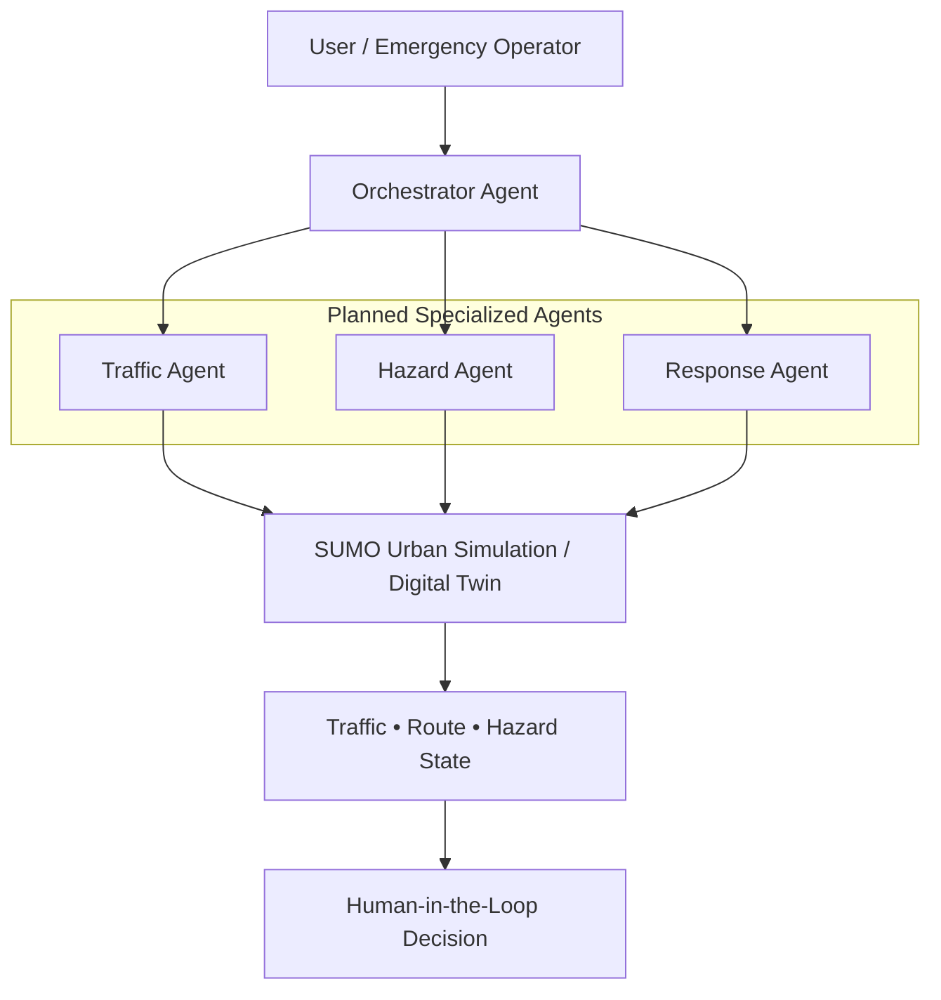

# UrbanResilience Multi-Agent Operations

**Agentic AI + SUMO Digital Twin for Emergency Transportation Decision Support**

## Overview

This research concept/prototype explores how agentic AI can interact with a SUMO-based urban transportation simulation to support emergency-response decision making. Its existing research foundation combines SUMO traffic simulation, Unity/VR visualization, emergency vehicle operation, road-block and hazard scenarios, route and traffic metrics, and human-in-the-loop interaction. The next research phase proposes a lightweight multi-agent layer for querying simulation state and supporting what-if analyses. Operators would retain responsibility for interpreting results and making decisions.

## Motivation

Blocked roads, flooding, infrastructure disruption, and congestion can rapidly change transportation conditions during urban emergencies. This research direction explores natural-language, tool-using AI agents as a way for operators to interact with simulation data alongside conventional simulation interfaces.

## Prototype Architecture

**Proposed architecture — the agentic layer is planned, not yet implemented.**

## Agent Roles

The following roles describe intended next-phase capabilities, not deployed agents.

### Orchestrator Agent

Would route user questions and tasks to the appropriate specialized agent.

### Traffic Agent

Would query simulated traffic conditions, congestion, travel time, and routing information.

### Hazard Agent

Would track simulated blocked roads, hazard locations, and unavailable network links.

### Response Agent

Would combine traffic and hazard information to support emergency-response route evaluation and what-if analysis. Its role would be advisory, with decisions retained by the human operator.

## Example What-If Queries

Illustrative questions for the planned agentic layer:

- "What is the fastest current route for the emergency vehicle?"
- "How does closing this road affect response time?"
- "Which route avoids the blocked roadway?"
- "What happens to network travel time if this corridor becomes unavailable?"
- "Which simulated conditions should the operator review first?"

## Existing Simulation Foundation

Already-developed components of the underlying research simulation:

- SUMO urban traffic simulation
- Unity/VR visualization
- Ego emergency vehicle
- Hazard and road-block scenarios
- Route and traffic metrics
- Human participant interaction
- Emergency-driving simulation

## Planned Agentic AI Layer

Planned next-phase capabilities:

- Multi-agent orchestration
- Tool/function calling
- Natural-language simulation queries
- Scenario-based what-if analysis
- Simulation-state retrieval
- Human-in-the-loop recommendations
- Agent activity and audit logging

LangGraph is being considered as a candidate orchestration framework; it is not an implemented component.

## Technology

SUMO • Unity • Python • TraCI • VR • Agentic AI • LLM Tool Calling

Agentic AI and LLM tool calling refer to the planned research layer.

## Research Direction

The broader goal is to investigate human-agent collaboration within AI-enabled digital twins for emergency transportation and urban resilience. The research would examine how simulation-assisted decision support can help operators compare scenarios, interpret changing network conditions, and review agent recommendations while retaining human oversight.

## Status

**Research prototype / work in progress**

The SUMO–Unity emergency-driving simulation foundation has been developed. The multi-agent AI layer described here represents the next phase of the research prototype.

## Future Demonstration

A short demonstration video and interactive prototype will be added as development progresses.

## Disclaimer

This project is a research prototype for simulation-based decision support and is not intended for operational emergency-response deployment.
